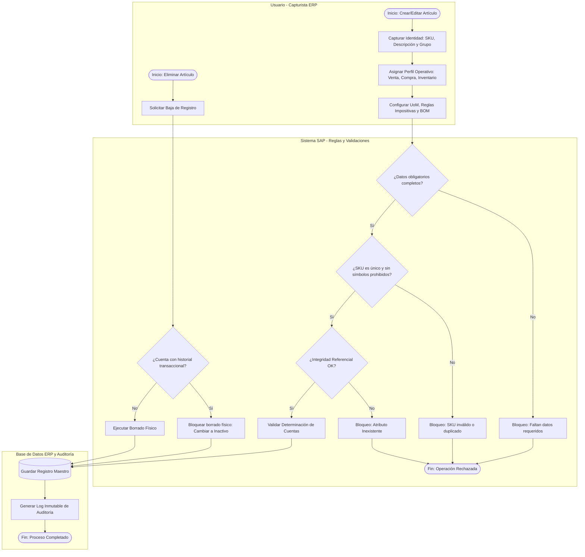

```mermaid
graph TD
    subgraph Usuario [Usuario - Capturista ERP]
        E1([Inicio: Crear/Editar Artículo]) --> T1[Capturar Identidad: SKU, Descripción y Grupo]
        T1 --> T2[Asignar Perfil Operativo: Venta, Compra, Inventario]
        T2 --> T3[Configurar UoM, Reglas Impositivas y BOM]
        
        E2([Inicio: Eliminar Artículo]) --> T4[Solicitar Baja de Registro]
    end

    subgraph Sistema [Sistema SAP - Reglas y Validaciones]
        T3 --> G1{¿Datos obligatorios completos?}
        G1 -- No --> Err1[Bloqueo: Faltan datos requeridos]
        
        G1 -- Sí --> G2{¿SKU es único y sin símbolos prohibidos?}
        G2 -- No --> Err2[Bloqueo: SKU inválido o duplicado]
        
        G2 -- Sí --> G3{¿Integridad Referencial OK?}
        G3 -- No --> Err3[Bloqueo: Atributo Inexistente]
        
        G3 -- Sí --> T5[Validar Determinación de Cuentas]
        
        T4 --> G4{¿Cuenta con historial transaccional?}
        G4 -- Sí --> T6[Bloquear borrado físico: Cambiar a Inactivo]
        G4 -- No --> T7[Ejecutar Borrado Físico]
        
        %% Conexión de errores a fin del proceso
        Err1 --> F2([Fin: Operación Rechazada])
        Err2 --> F2
        Err3 --> F2
    end

    subgraph BD [Base de Datos ERP y Auditoría]
        T5 --> T8[(Guardar Registro Maestro)]
        T6 --> T8
        T7 --> T8
        
        T8 --> T9[Generar Log Inmutable de Auditoría]
        T9 --> F1([Fin: Proceso Completado])
    end
```
